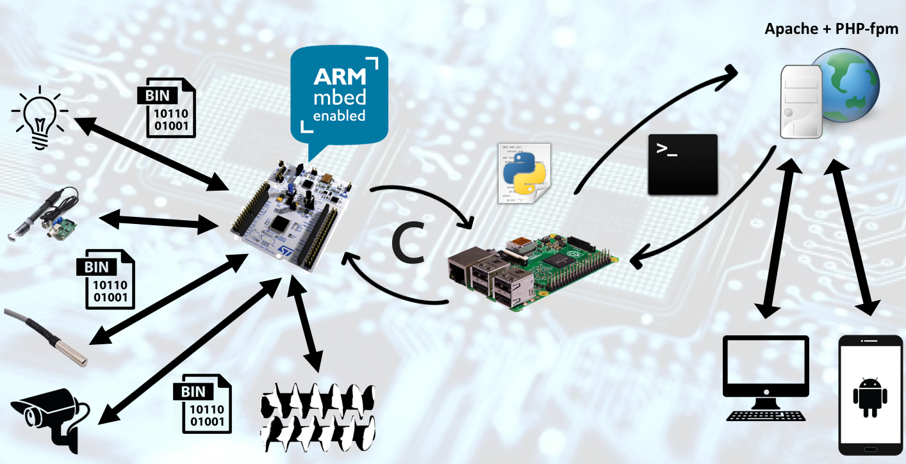
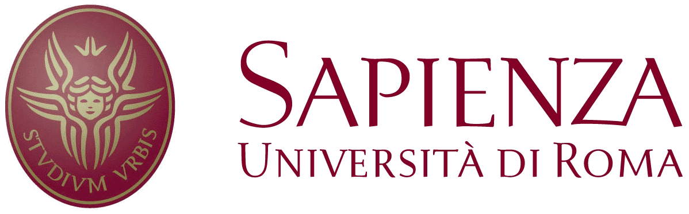

# Asbtract

Feed The Reef is a group project developed during the Pervasive Systems course at "La Sapienza" University of Rome. The idea is to build an IoT environment in order to realize a smart fish tank. The goal of the project is to provide a cheap and versatile feeding system, in order to allow fish tank's owners to take care of their pets while abroad, during holidays or during the busy work days.
The main advantage of our solution, compared to the existing services on the market, is the possibility to access the sensors through a web interface, being able to interact with the fish tank whenever the user wants; moreover, is a cheap and modular solution that can be easily implemented to interact also with other types of feeding environments (e.g. dogs, cats, birds, etc.).

# How does it work?
The project is conceptually divided into three parts:
* The high level that presents the actual status of the environment and allows the user to interact with it
* The middle layer which elaborates all the information available from both the high and lower levels
* The low level that collects all information retrived from sensors and executes the commands received from the middle layer (e.g. status of the enviroment, feed the fishes, temperature value, etc.).

## Architecture

The user is able to connect to the web interface from his own laptop or mobile device. The information are elaborated from a Web server, written using Apache and PHP-fpm technologies, which communicates directly with the Raspberry Pi 3 sending shell commands through bash scripts. Those scripts are refined using some Python functions to be executed inside the Nucleo STM32-F401 board which sends binaries commands towards different sensors, depending on the action that the user wants to accomplish.

## Web Interface
TODO
### Hardware

* Raspberry Pi 3
* Analog PH Sensor
* Analog Temperatur Sensos
* Led lights
* Nucleo STM32-F401.

### Technologies
* ARM Mbed OS
* Python
* Apache 
* PHP
* Bash scripting

### Software
For the software level:

* High level part:
  * Remote Control
    * Android Application
    * Middle layer software on the Raspberry Pi 3 (Not decide yet)
* Middle layer part:
  * Programming language:
    * Python and Postgresql as DBMS on the Raspberry Pi 3
    * C on the Nucleo STM32
* Low layer part:
  * Operating System:
    * Arch linux on the Raspberry Pi 3
  
# Code
* [STM Nucleo board]()
* [Raspberry Pi 3]()
* [Web Server](https://github.com/jacopomv/FeedTheReef/tree/master/Webserver)
* [Web Interface]()

# Contact our project members
Linkedin: 
 * [Enrico G.M. Verzegnassi](http://www.linkedin.com/in/enrico-verzegnassi)
 * [Jacopo Maria Valtorta](https://www.linkedin.com/in/jacopo-maria-valtorta)
 
# Check out our project presentation
SlideShare: [Feed the Reef](https://www.slideshare.net/JacopoMariaValtorta/feed-the-reef-96402146)
#

