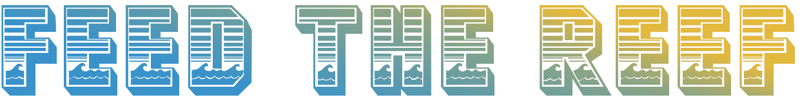
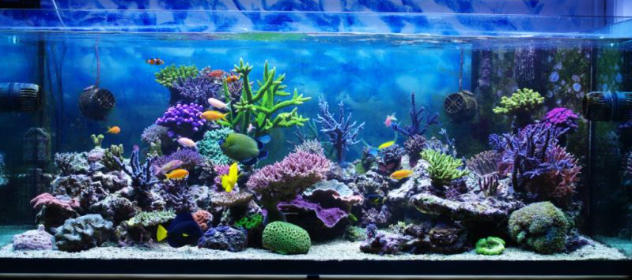
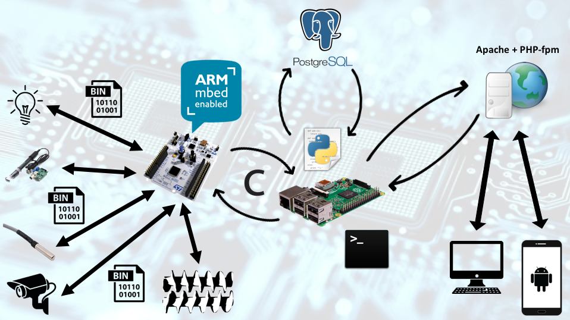
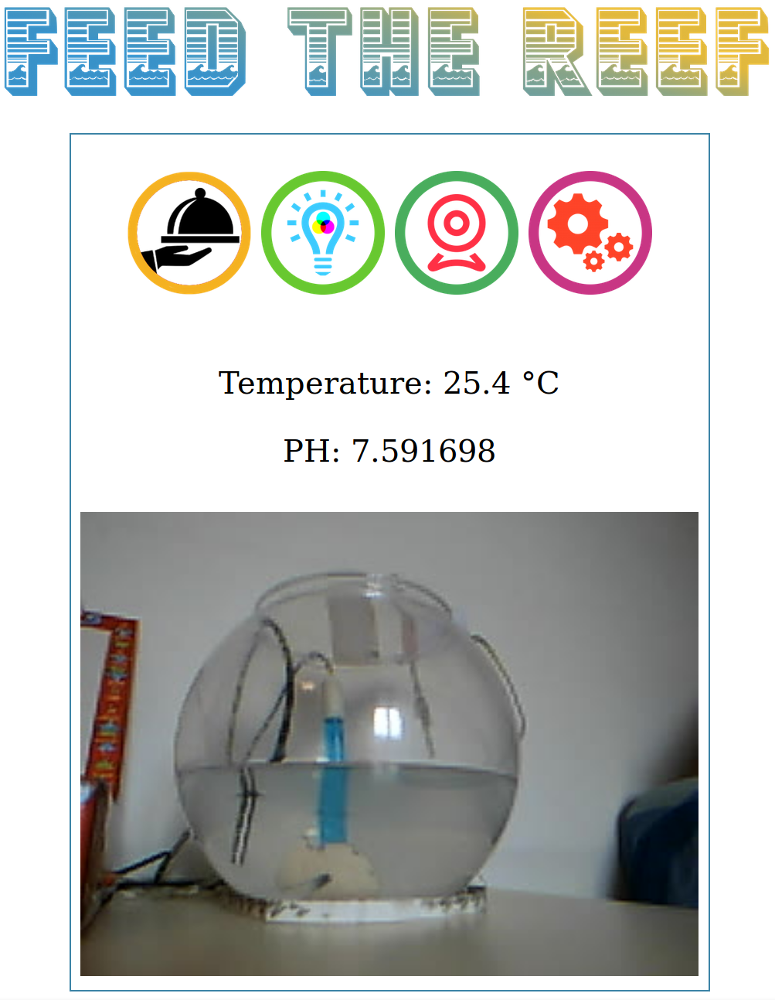
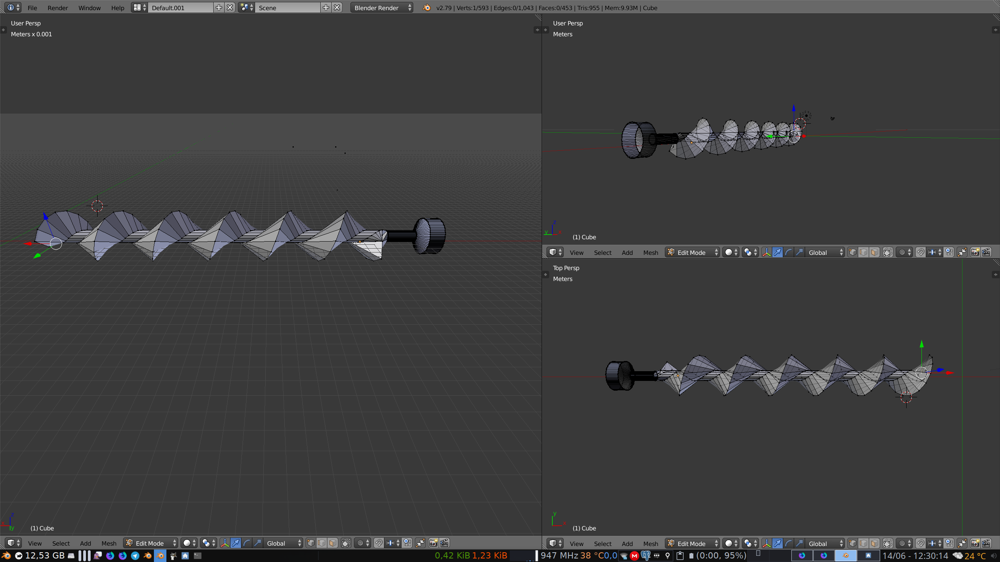
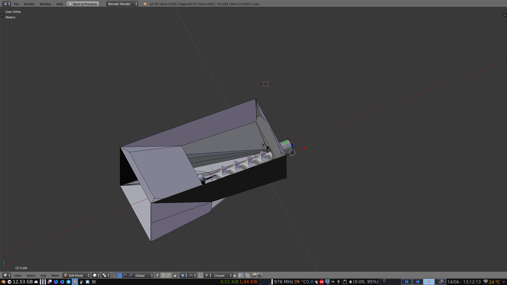
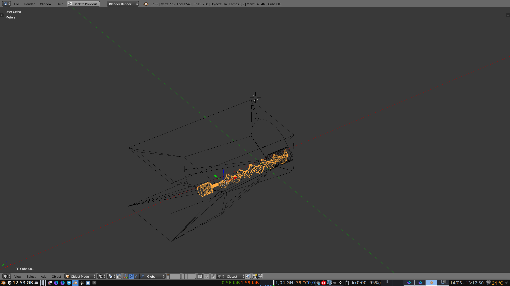
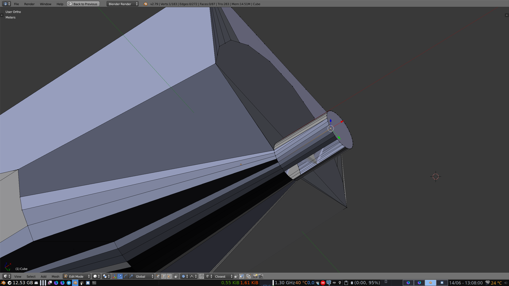
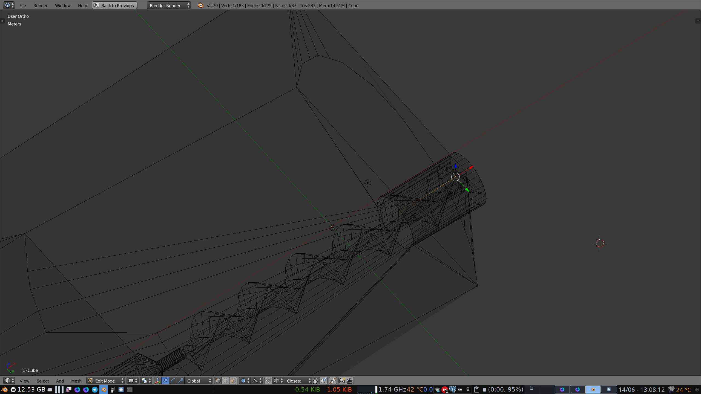
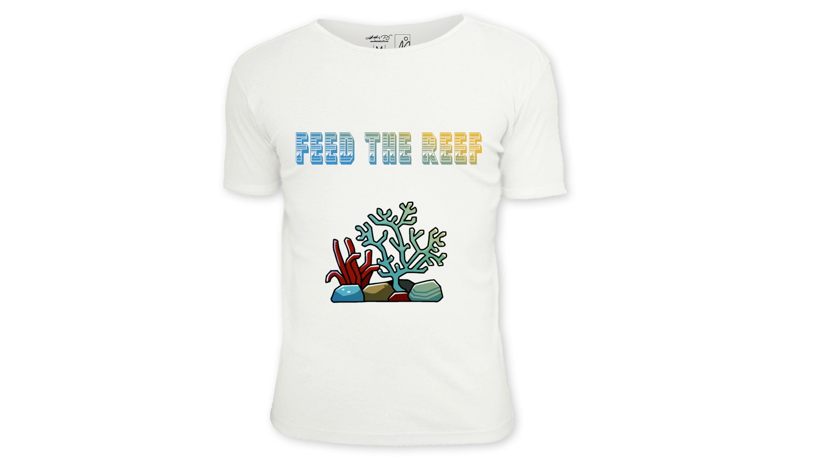

## Abstract
Feed The Reef is a group project developed during the Pervasive Systems course at "La Sapienza" University of Rome. The idea is to build an IoT environment in order to realize a smart fish tank. The goal of the project is to provide a cheap and versatile feeding system, in order to allow fish tank's owners to take care of their pets while abroad, during holidays or during busy work days.
The main advantage of our solution, compared to the existing services on the market, is the possibility to access the sensors through a web interface, being able to interact with the fish tank whenever the user wants; moreover, is a cheap and versatile solution that can be easily implemented to interact also with other types of feeding environments (e.g. dogs, cats, birds, etc.).

**-Update**
An extra work on the project is in progress in order to increase its adaptability taking advantage of the LoRa technology.
## How does it work?
The project is conceptually divided into three parts:
* The frontend layer that presents the actual status of the environment through a web interface and allows the user to interact with the system
* The middle layer, realised with a Python server continuously running on the Raspberry Pi 3, which elaborates all the information available from both the high and lower levels
* The low layer, realised entirely on the Nucleo STM32 board, that collects all information retrived from sensors and executes the commands received from the middle layer (e.g. status of the enviroment, feed the fishes, temperature value, etc.).

**-Update**
The new update will permit the low layer to communicate with the middle layer remotly through LoRa technology. This update permits to increase the number of low level devices connected to the middle layer and freely move them in the environment.
### Architecture

#### Brief description
The user is able to connect to the web interface from his own laptop or mobile device.
The information are visible through an Apache Web server supported by a PHP-fpm interpreter, which communicates directly with the backend: a Python Web server running on the Raspberry Pi 3.
Moreover, the Raspberry is connected through a Serial Peripheral Interface (SPI) to the Nucleo STM32-F401 board, which sends commands towards different sensors, depending on the action that the user wants to accomplish.

**-Update**
The "Nucleo STM32-F401" board has been changed with the "B-L072Z-LRWAN1" in order to remove the usb cable between the board and the Raspberry Pi 3 and permit the remote communication through the LoRa tecnology.
The communication is encrypted through symmetric encryption technology, the well known AES algorithm.
Still some work is going on for completing the porting. In particular the compatibility with the temperature sensor DS1820 not recognized by the board. Help me on this issue on the [official mbed forum](https://os.mbed.com/questions/84204/Detection-of-tempertaure-sensor-DS1820-o/#answer15935)
### Web Interface

This is the simple web interface through which the user is able to send commands remotely to the system and receive back a live streaming from the webcam.

**-Update**
In addition it is available the [Grafana](https://grafana.com/) platform for viewing and monitor the data recorded by the system.
### Hardware

* Raspberry Pi 3
* Nucleo STM32-F401
* Analog PH Sensor
* Analog Temperature Sensor
* Led lights
* Webcam

**-Update**
* B-L072Z-LRWAN1

### Technologies used
* ARM Mbed OS
* Python
* Apache 
* PHP
* PostgreSQL
* Bash scripting

**-Update**
* Grafana

### Future features

  
   
  
  
  

We designed a Blender model for the screw and the tank containing the food, beacuse the current one is really coarse handmade.
  
### Demo
[Demo - YouTube](https://youtu.be/6Z3a6HSi4M8)

### Code
* [STM Nucleo board](https://github.com/jacopomv/FeedTheReef/tree/master/Nucleo%20STM32%20)
* [Backend](https://github.com/jacopomv/FeedTheReef/tree/master/Raspberry%20Pi%203/Backend/PythonServer)
* [Frontend](https://github.com/jacopomv/FeedTheReef/tree/master/Raspberry%20Pi%203/Frontend/Webserver)

# Contact our project members
Linkedin: 
 * [Enrico G.M. Verzegnassi](http://www.linkedin.com/in/enrico-verzegnassi)
 * [Jacopo Maria Valtorta](https://www.linkedin.com/in/jacopo-maria-valtorta)
 
# Check out our project presentation
SlideShare: 
* [Feed the Reef](https://www.slideshare.net/JacopoMariaValtorta/feed-the-reef-96402146)
* [Feed the Reef - Final Architecture](https://www.slideshare.net/JacopoMariaValtorta/feed-the-reef-final-architecture-presentation)
# Merchandising

#

