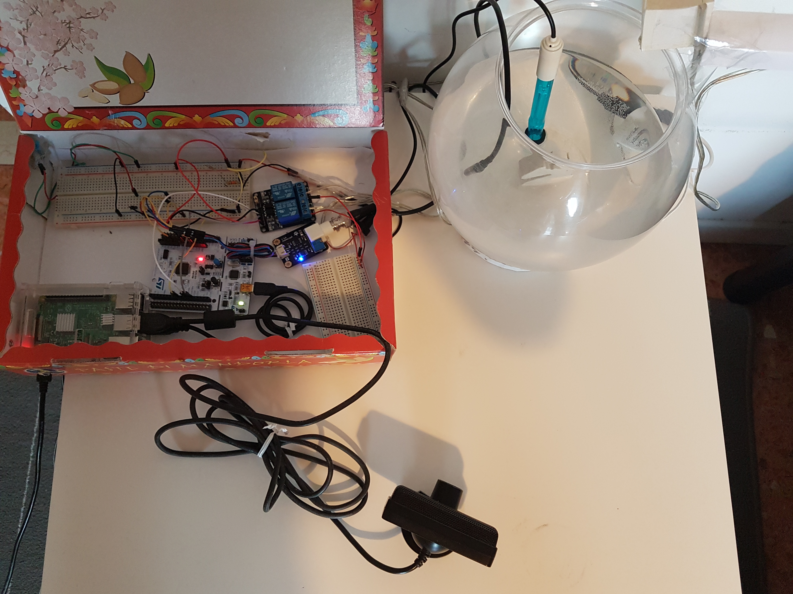

## Abstract
Feed The Reef is a group project developed during the Pervasive Systems course at "La Sapienza" University of Rome. The idea is to build an IoT environment in order to realize a smart fish tank. The goal of the project is to provide a cheap and versatile feeding system, in order to allow fish tank's owners to take care of their pets while abroad, during holidays or during the busy work days.
The main advantage of our solution, compared to the existing services on the market, is the possibility to access the sensors through a web interface, being able to interact with the fish tank whenever the user wants; moreover, is a cheap and versatile solution that can be easily implemented to interact also with other types of feeding environments (e.g. dogs, cats, birds, etc.).

## How does it work?
The project is conceptually divided into three parts:
* The frontend level that presents the actual status of the environment thorugh a web interface and allows the user to interact with the system
* The middle layer, realised with a Python server continuously running on the Raspberry Pi 3, which elaborates all the information available from both the high and lower levels
* The low level, realised entirely on the Nucleo STM32 board, that collects all information retrived from sensors and executes the commands received from the middle layer (e.g. status of the enviroment, feed the fishes, temperature value, etc.).

### Architecture

#### Brief description
The user is able to connect to the web interface from his own laptop or mobile device. The information are elaborated from an Apache Web server supported with a PHP-fpm interpreter, which communicates directly with a Python Web server running on the Raspberry Pi 3 connected through a serial port to the Nucleo board. Thus, the Nucleo STM32-F401 board sends commands towards different sensors, depending on the action that the user wants to accomplish.

### Web Interface

This is the simple web interface thourgh which the user is able to send commands remotely to the system and receive back a live streaming from the webcam.
### Hardware

* Raspberry Pi 3
* Nucleo STM32-F401
* Analog PH Sensor
* Analog Temperature Sensor
* Led lights
* Webcam

### Technologies
* ARM Mbed OS
* Python
* Apache 
* PHP
* Bash scripting

### Future features

  
   
  
  
  

We designed a Blender model for the screw and the tank containing the food, beacuse, actually, the current one is really row handmade.
  
### Demo
TODO

### Code
* [STM Nucleo board](https://github.com/jacopomv/FeedTheReef/tree/master/Nucleo%20STM32%20)
* [Backend](https://github.com/jacopomv/FeedTheReef/tree/master/Raspberry%20Pi%203/Backend/PythonServer)
* [Frontend](https://github.com/jacopomv/FeedTheReef/tree/master/Raspberry%20Pi%203/Frontend/Webserver)

# Contact our project members
Linkedin: 
 * [Enrico G.M. Verzegnassi](http://www.linkedin.com/in/enrico-verzegnassi)
 * [Jacopo Maria Valtorta](https://www.linkedin.com/in/jacopo-maria-valtorta)
 
# Check out our project presentation
SlideShare: [Feed the Reef](https://www.slideshare.net/JacopoMariaValtorta/feed-the-reef-96402146)
#

